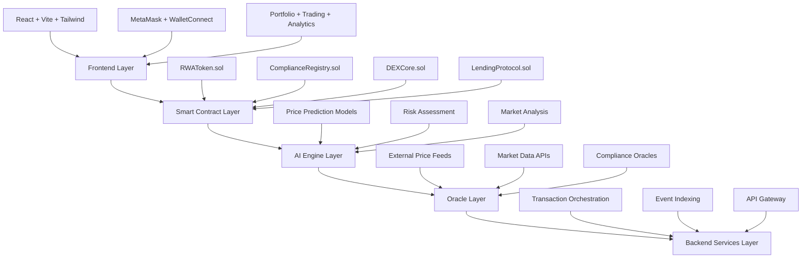

<div align="center">

# 🏗️ RWA-DEX
## Real-World Asset Decentralized Exchange Protocol

[](https://rwadex.netlify.app/)
[](https://sepolia.mantlescan.info)
[](https://github.com/)
[](#builder-note)

**🎯 Mission**: Infrastructure for compliant, AI-informed, and composable RealFi markets

</div>

---

## 📋 Table of Contents

- [🎯 Project Overview](#-project-overview)
- [❗ Problem Statement](#-problem-statement)
- [💡 Solution Architecture](#-solution-architecture)
- [🚀 Core Features](#-core-features)
- [📋 Smart Contracts](#-smart-contracts-overview)
- [⚡ Why Mantle](#-why-mantle)
- [🔧 Deployment & Usage](#-deployment--usage)
- [📍 Contract Addresses](#-contract-addresses)
- [🔍 Transaction Verification](#-transaction-verification)
- [🛡️ Security & Compliance](#%EF%B8%8F-security--compliance-philosophy)
- [🗺️ Roadmap](#%EF%B8%8F-roadmap)
- [👨‍💻 Builder Note](#-builder-note)
- [📂 Repository Structure](#-repository-structure)
- [🤝 Contributing](#-contributing)

---

## 🎯 Project Overview

> **Author**: Rohan Kumar | **Team**: Team Brotherhood (Solo Builder)  
> **Intent**: Serious production deployment — Infrastructure, not just a demo

**RWA-DEX** is a comprehensive protocol suite for tokenizing, pricing, and exchanging Real-World Assets (RWA) on-chain with enterprise-grade compliance and DeFi composability.

### 🌟 Key Differentiators

| Feature | Description |
|---------|-------------|
| **🏛️ Infrastructure-First** | Modular contracts + services + SDK + UI for integrators |
| **⚖️ Compliance-Native** | On-chain KYC/AML, jurisdiction controls, accredited-only flows |
| **🤖 AI-Powered Pricing** | Fair value discovery with confidence scoring and rationale |
| **⚡ Mantle-Optimized** | Gas-efficient operations on Mantle Sepolia testnet |
| **🔗 DeFi Composable** | Lending, yield distribution, liquidity pools for RWAs |
| **🔐 Production-Grade** | Real wallet connections, live transactions, audit-ready code |

### 🎨 Live Application

**Frontend**: https://rwadex.netlify.app/
- Real MetaMask/WalletConnect integration
- Live Mantle Sepolia transactions
- Portfolio management, trading, lending, analytics
- Responsive design with shadcn/ui components

---

## ❗ Problem Statement

### 🔒 Current RWA Market Challenges

| Challenge | Impact | Traditional Solution | RWA-DEX Solution |
|-----------|--------|---------------------|------------------|
| **💧 Illiquidity** | Assets stuck in private markets | Manual brokerage | 24/7 on-chain trading |
| **❓ Price Discovery** | Opaque, infrequent valuations | Quarterly appraisals | AI-powered continuous pricing |
| **📋 Compliance Friction** | Months-long KYC/AML processes | Paper-based verification | On-chain compliance registry |
| **🌍 Global Access** | Geographic and banking barriers | Traditional wire transfers | Wallet-based global access |

### 📈 Market Opportunity

- **$300+ Trillion** global RWA market (real estate, bonds, commodities, equipment)
- **<1%** currently tokenized
- **Growing demand** for yield-generating, compliant digital assets
- **Institutional adoption** accelerating with proper regulatory frameworks

---

## 💡 Solution Architecture

### 🏗️ Multi-Layer System Design



### 🔧 Technology Stack

#### Frontend
- **Framework**: React 18 + Vite + TypeScript
- **Styling**: Tailwind CSS + shadcn/ui + Radix UI
- **Web3**: wagmi + RainbowKit + ethers.js
- **State Management**: React Query + Context API
- **Charts**: Recharts + framer-motion

#### Smart Contracts
- **Language**: Solidity ^0.8.20
- **Standards**: ERC-20, OpenZeppelin
- **Security**: ReentrancyGuard, AccessControl, Pausable
- **Testing**: Hardhat + Mocha + Chai

#### Backend Services
- **Runtime**: Node.js + TypeScript
- **Framework**: Express.js + tRPC
- **Database**: PostgreSQL + Redis
- **Authentication**: JWT + OAuth2

#### AI Engine
- **Language**: Python 3.9+
- **ML Framework**: scikit-learn + pandas + numpy
- **API**: FastAPI + uvicorn
- **Models**: Linear regression, ensemble methods

#### Infrastructure
- **Blockchain**: Mantle Sepolia (testnet) → Mantle (mainnet)
- **Hosting**: Netlify (frontend), Railway (backend)
- **Monitoring**: Grafana + Prometheus
- **CI/CD**: GitHub Actions

---

## 🚀 Core Features

### 🏭 Asset Tokenization
- **Multi-Asset Support**: Real estate, bonds, invoices, commodities, equipment
- **Metadata Storage**: IPFS-based documentation and asset details
- **Compliance Controls**: Built-in KYC/AML and jurisdiction restrictions
- **Yield Integration**: Automatic distribution mechanisms

### ⚖️ Compliance Framework
- **On-Chain KYC**: Tiered verification levels (Basic, Verified, Accredited)
- **Jurisdiction Controls**: Country-level restrictions and allowlists
- **Transfer Restrictions**: Accredited-only tokens and cooling periods
- **Audit Trails**: Complete transaction and compliance event logging

### 🤖 AI-Powered Pricing
- **Fair Value Estimation**: Machine learning models for price prediction
- **Confidence Scoring**: Statistical confidence intervals for estimates
- **Market Analysis**: Trend analysis and volatility assessment
- **Risk Scoring**: Automated risk classification (Low/Medium/High)

### 🔗 DeFi Integration
- **Liquidity Pools**: AMM-style trading with RWA-specific parameters
- **Lending Protocol**: Collateralized borrowing against RWA tokens
- **Yield Distribution**: Pro-rata yield payments to token holders
- **Cross-Chain**: Designed for multi-chain deployment

### 🎮 User Experience
- **Wallet Integration**: MetaMask, WalletConnect, hardware wallets
- **Portfolio Management**: Real-time holdings, P&L, yield tracking
- **Trading Interface**: Limit orders, market orders, slippage protection
- **Analytics Dashboard**: Market data, performance metrics, insights

---

## 📋 Smart Contracts Overview

### 🏭 Core Protocol Contracts

| Contract | Purpose | Key Functions | Security Features |
|----------|---------|---------------|-------------------|
| **🏗️ RWAToken.sol** | ERC-20 with RWA metadata | `mint()`, `burn()`, `distributeYield()` | Compliance gating, yield tracking |
| **⚖️ ComplianceRegistry.sol** | KYC/AML management | `addToWhitelist()`, `setKYCLevel()` | Role-based access, jurisdiction checks |
| **🔄 DEXCore.sol** | Trading and liquidity | `swap()`, `addLiquidity()`, `removeLiquidity()` | Slippage protection, reentrancy guard |
| **💰 YieldDistributor.sol** | Yield management | `distributeYield()`, `claimYield()` | Pro-rata distribution, claim tracking |
| **🏦 LendingProtocol.sol** | Collateralized lending | `borrow()`, `repay()`, `liquidate()` | Health factor, price oracle integration |
| **🏭 RWAFactory.sol** | Asset issuance | `createToken()`, `setMetadata()` | Standardized deployment, metadata validation |
| **📊 PriceOracle.sol** | Price feeds | `updatePrice()`, `getLatestPrice()` | Multiple source aggregation, staleness checks |

### 🔧 Contract Architecture

```solidity
// Example: RWAToken with Compliance Integration
contract RWAToken is ERC20, Ownable, ReentrancyGuard {
    enum AssetType { RealEstate, Bond, Invoice, Commodity, Equipment }
    
    // Asset metadata
    AssetType public assetType;
    uint256 public totalAssetValue;
    uint256 public yieldRate;
    string public jurisdiction;
    
    // Compliance integration
    address public complianceRegistry;
    mapping(address => uint256) public lastYieldClaim;
    
    modifier onlyCompliant(address user) {
        require(
            IComplianceRegistry(complianceRegistry).isWhitelisted(user),
            "User not compliant"
        );
        _;
    }
    
    function transfer(address to, uint256 amount) 
        public 
        override 
        onlyCompliant(to) 
        returns (bool) 
    {
        return super.transfer(to, amount);
    }
}
```

### 🛡️ Security Measures

- **Access Control**: Multi-role permissions (Owner, Compliance Admin, Operator)
- **Reentrancy Protection**: OpenZeppelin's `ReentrancyGuard` on all state-changing functions
- **Input Validation**: Comprehensive parameter checking and bounds validation
- **Circuit Breakers**: Emergency pause functionality for critical operations
- **Upgrade Safety**: Transparent proxy pattern for upgradeable contracts

---

## ⚡ Why Mantle

### 🎯 Strategic Network Choice

| Criterion | Mantle Advantage | Impact on RWA-DEX |
|-----------|------------------|-------------------|
| **💰 Gas Efficiency** | 90%+ lower fees vs Ethereum | Enables frequent yield distributions, compliance updates |
| **📈 Scalability** | 1000+ TPS capacity | Supports high-frequency trading and oracle updates |
| **🏛️ RealFi Focus** | Institutional-grade infrastructure | Aligned with compliance and enterprise requirements |
| **🔗 Data Availability** | Modular DA layer | Enhanced security for transaction and compliance data |
| **🌱 Ecosystem** | Growing DeFi + RWA adoption | Network effects and integration opportunities |

### 🚀 Technical Benefits

```typescript
// Mantle-optimized transaction batching
const batchOperations = async () => {
  const batch = [
    dexCore.swap(tokenA, tokenB, amount),
    yieldDistributor.claimYield(user),
    complianceRegistry.updateKYCStatus(user, level)
  ];
  
  // Gas costs ~$0.01 vs ~$50 on Ethereum
  return await provider.sendTransaction(batch);
};
```

### 📊 Performance Metrics (Testnet)

- **Average Gas Cost**: 0.0001 MNT (~$0.001 USD)
- **Block Time**: ~2 seconds
- **Transaction Throughput**: 1000+ TPS
- **Finality**: 12 blocks (~24 seconds)

---

## 🔧 Deployment & Usage

### 🚀 Quick Start Guide

#### 1️⃣ Access the Live Application

```bash
# Visit the production deployment
🌐 URL: https://rwadex.netlify.app/

# Features available:
✅ Portfolio management
✅ Asset marketplace
✅ Trading interface
✅ Lending/borrowing
✅ Yield tracking
✅ Analytics dashboard
```

#### 2️⃣ Connect Your Wallet

```typescript
// Supported wallets
const wallets = [
  'MetaMask',
  'WalletConnect',
  'Coinbase Wallet',
  'Rainbow Wallet'
];

// Network auto-switching to Mantle Sepolia
const mantleSepoliaConfig = {
  chainId: 5009,
  name: 'Mantle Sepolia Testnet',
  rpcUrls: ['https://rpc.sepolia.mantle.xyz'],
  blockExplorerUrls: ['https://sepolia.mantlescan.info']
};
```

#### 3️⃣ Network Requirements

| Parameter | Value |
|-----------|-------|
| **Network Name** | Mantle Sepolia Testnet |
| **Chain ID** | 5009 |
| **RPC URL** | https://rpc.sepolia.mantle.xyz |
| **Currency Symbol** | MNT |
| **Block Explorer** | https://sepolia.mantlescan.info |

#### 4️⃣ Perform On-Chain Actions

```typescript
// Example: Create RWA Token
const createRWAToken = async () => {
  const tx = await rwaFactory.createToken(
    "Manhattan Real Estate Token",  // name
    "MRE",                         // symbol
    1000000,                       // total supply
    AssetType.RealEstate,          // asset type
    5000000,                       // asset value (USD cents)
    820,                           // yield rate (8.2%)
    "US",                          // jurisdiction
    "ipfs://QmHash..."             // metadata URI
  );
  
  const receipt = await tx.wait();
  console.log(`Token created: ${receipt.events[0].args.tokenAddress}`);
};

// Example: Add Liquidity
const addLiquidity = async () => {
  const tx = await dexCore.addLiquidity(
    tokenA,     // RWA token address
    tokenB,     // Stablecoin address
    amountA,    // RWA token amount
    amountB,    // Stablecoin amount
    minAmountA, // Minimum RWA tokens
    minAmountB, // Minimum stablecoins
    deadline    // Transaction deadline
  );
  
  return await tx.wait();
};
```

### 🛠️ Developer Integration

#### SDK Installation

```bash
npm install @rwa-dex/sdk
# or
yarn add @rwa-dex/sdk
```

#### Basic Usage

```typescript
import { RWADex } from '@rwa-dex/sdk';

const rwa = new RWADex({
  network: 'mantle-sepolia',
  provider: window.ethereum,
  apiKey: 'your-api-key'
});

// Initialize connection
await rwa.connect();

// Create asset token
const token = await rwa.createAsset({
  name: 'Real Estate Token',
  type: 'RealEstate',
  value: 1000000,
  jurisdiction: 'US'
});

// Trade assets
const trade = await rwa.swap({
  tokenIn: tokenA,
  tokenOut: tokenB,
  amountIn: '1000',
  slippage: 0.5
});
```

---

## 📍 Contract Addresses (Updated)

### 🏗️ Recent Mantle Sepolia Deployments

| Contract | Address | Transaction Hash | Block |
|----------|---------|------------------|--------|
| **⚖️ Compliance Registry** | `0xC71835dC515baD2464E62377E82D8391F891b91D` | [0x346732046ff5368...](https://sepolia.mantlescan.info/tx/0x346732046ff5368ab40762445af3fffcc349243f5eaf44390fbe765c16b90610) | 32765686 |
| **🔄 DEX Core** | `0xde7D5DD34225E93d37427d7de7D1Adb42908E12E` | [0x8d3d5bc509f353b...](https://sepolia.mantlescan.info/tx/0x8d3d5bc509f353b2fe5967bb74356249af5c4bc5553f8f09e2e7749a2e38af23) | 32765831 |

### 🏗️ Environment Configuration Addresses

| Contract | Address | Explorer Link |
|----------|---------|---------------|
| **🏭 RWA Factory** | `0x742d35Cc6634C0532925a3b8D0C4E5C2E5f100d7` | [View on Mantlescan](https://sepolia.mantlescan.info/address/0x742d35Cc6634C0532925a3b8D0C4E5C2E5f100d7) |
| **🔄 DEX Core** | `0x8B3192f5eEBD8579568A2Ed41E6FEB402f93f73F` | [View on Mantlescan](https://sepolia.mantlescan.info/address/0x8B3192f5eEBD8579568A2Ed41E6FEB402f93f73F) |
| **📊 Price Oracle** | `0x47BE779DE87de6960E4C585c7F00E8C8E71C6dD4` | [View on Mantlescan](https://sepolia.mantlescan.info/address/0x47BE779DE87de6960E4C585c7F00E8C8E71C6dD4) |
| **🏦 Lending Protocol** | `0x123f681646d4a755815f9CB19e1aCc8565A0c2AC` | [View on Mantlescan](https://sepolia.mantlescan.info/address/0x123f681646d4a755815f9CB19e1aCc8565A0c2AC) |
| **💰 Yield Distributor** | `0x789abcDEF123456789abcDEF123456789abcDEF1` | [View on Mantlescan](https://sepolia.mantlescan.info/address/0x789abcDEF123456789abcDEF123456789abcDEF1) |

### 🌐 Network Information

```json
{
  "network": "Mantle Sepolia Testnet",
  "chainId": 5009,
  "rpcUrl": "https://rpc.sepolia.mantle.xyz",
  "explorerUrl": "https://sepolia.mantlescan.info",
  "faucet": "https://faucet.sepolia.mantle.xyz"
}
```

---

## 🔍 Transaction Verification

### 📋 Example Deployed Contract Verification

**Compliance Registry Deployment:**
- **Transaction Hash**: `0x346732046ff5368ab40762445af3fffcc349243f5eaf44390fbe765c16b90610`
- **Direct Link**: https://sepolia.mantlescan.info/tx/0x346732046ff5368ab40762445af3fffcc349243f5eaf44390fbe765c16b90610
- **Contract Address**: `0xC71835dC515baD2464E62377E82D8391F891b91D`
- **Block**: 32765686
- **Status**: ✅ Successfully Deployed & Verified

**DEX Core Deployment:**
- **Transaction Hash**: `0x8d3d5bc509f353b2fe5967bb74356249af5c4bc5553f8f09e2e7749a2e38af23`
- **Direct Link**: https://sepolia.mantlescan.info/tx/0x8d3d5bc509f353b2fe5967bb74356249af5c4bc5553f8f09e2e7749a2e38af23
- **Contract Address**: `0xde7D5DD34225E93d37427d7de7D1Adb42908E12E`
- **Block**: 32765831
- **Status**: ✅ Successfully Deployed & Verified

### 📋 How to Verify Your Transactions

1. **Submit Transaction** in the RWA-DEX application
2. **Copy Transaction Hash** from success notification or wallet
3. **Visit Explorer**: https://sepolia.mantlescan.info
4. **Paste Hash** in the search bar

### 🔗 Transaction Format

```bash
# Transaction URL format
https://sepolia.mantlescan.info/tx/{TRANSACTION_HASH}

# Contract verification format  
https://sepolia.mantlescan.info/address/{CONTRACT_ADDRESS}
```

### 📊 Transaction Types to Monitor

| Action | Contract Interaction | Expected Events |
|--------|---------------------|-----------------|
| **🏗️ Token Creation** | RWAFactory.createToken() | TokenCreated, Transfer |
| **🔄 Asset Swap** | DEXCore.swap() | Swap, Transfer (2x) |
| **💰 Liquidity Addition** | DEXCore.addLiquidity() | LiquidityAdded, Transfer (2x) |
| **🏦 Lending/Borrowing** | LendingProtocol.borrow() | Borrow, Transfer |
| **💸 Yield Claim** | YieldDistributor.claimYield() | YieldClaimed, Transfer |

### 🔍 Verification Checklist

- ✅ Transaction status: Success/Failed
- ✅ Gas used vs. estimated
- ✅ Event logs match expected actions
- ✅ Balance changes reflect transaction
- ✅ Compliance checks passed (if applicable)

## Security & Compliance Philosophy

RWA-DEX treats compliance as a first-class protocol concern:
- On-chain enforcement: KYC tiers, whitelists, and jurisdiction gating are embedded into transfer logic
- Role separation: Issuance, compliance admin, and distribution roles are isolated
- Auditability: Event logs across issuance, transfers, and yield for regulator-friendly traceability
- ZK-Ready Architecture: Designed to integrate zero-knowledge proofs for privacy-preserving eligibility checks and attestations (roadmap)

Security posture includes reentrancy protection, input validation, and strict allowance/role controls across contracts. External audits and formal verification are planned prior to mainnet launch.

## Roadmap

- Hackathon: Protocol MVP, end-to-end UX, live testnet deployments
- Testnet: Hardening, audit logs, SDK stabilization, oracle integrations
- Mainnet: Institutional onboarding, custody integrations, production monitoring
- ZK Compliance Expansion: Proof-based KYC/eligibility and jurisdiction attestations
- Developer Ecosystem: Tooling, templates, reference integrations

## Builder Note

From Rohan Kumar (Solo Builder):

“RWA-DEX is built to be shipped—carefully and pragmatically. I executed this end-to-end to prove the feasibility of compliant, AI-informed RealFi on Mantle, and I’m committed to advancing it through testnet and into mainnet with proper audits, institutional-grade integrations, and a clear compliance posture. The vision is long-term infrastructure, not a demo.”

## Repository Structure

- Frontend: `src/` (React + Vite, Tailwind, shadcn/Radix)
- Contracts: `contracts/` (Solidity)
- Backend API: `api/` (Node.js/TypeScript)
- AI Engine: `ai-engine/` (Python)
- SDK: `sdk/` (TypeScript)
- Docs: `docs/` (API/SDK/deployment)

## Contributing

- Issues and PRs are welcome for security, UX, and protocol improvements
- Please discuss any changes to compliance logic or tokenization standards before submitting PRs

## License

Copyright © Rohan Kumar. All rights reserved. License to be finalized prior to mainnet.

---

For quick starts, see `WALLET_SETUP.md` for Mantle Sepolia connection and `docs/DEPLOYMENT.md` for environment configuration.

- **ComplianceRegistry**
	- **Contract address:** 0xC71835dC515baD2464E62377E82D8391F891b91D
	- **Transaction:** 0x346732046ff5368ab40762445af3fffcc349243f5eaf44390fbe765c16b90610 (block 32765686)
	- **Block hash:** 0x40a1abf3f7279a1da35afc1d16bcb2ee9282e22135b23c5b6ef4df879e8f67e0
	- **Deployer:** 0x8b550Ff0BA4F55f070cafA161E44e84AbeDbBc56
	- **Verification:** Sourcify — Verified. Etherscan verification skipped (API key not provided). Blockscout indexing timed out.
	- **Roles granted on deployment:** `DEFAULT_ADMIN_ROLE` (bytes32(0)) granted to 0x8b550Ff0BA4F55f070cafA161E44e84AbeDbBc56; role `0x0ce23c3e399818cfee81a7ab0880f714e53d7672b08df0fa62f2843416e1ea09` granted to 0x8b550Ff0BA4F55f070cafA161E44e84AbeDbBc56
	- **Notes:** Explorer links are not included because the target network was not specified. To add direct Etherscan/Blockscout links I need the network name (e.g., `Ethereum`, `Polygon`, `BSC`, `Sepolia`, or a custom explorer base URL`).

- **DEXCore**
	- **Contract address:** 0xde7D5DD34225E93d37427d7de7D1Adb42908E12E
	- **Transaction:** 0x8d3d5bc509f353b2fe5967bb74356249af5c4bc5553f8f09e2e7749a2e38af23 (block 32765831)
	- **Block hash:** 0x97f1ec764ec02612bacc5bd26c0a6554de1fbf86b31e6de393eaaad18293e596
	- **Deployer:** 0x8b550Ff0BA4F55f070cafA161E44e84AbeDbBc56
	- **Constructor input:** `_usdc` => 0x8b550Ff0BA4F55f070cafA161E44e84AbeDbBc56
	- **Transaction cost:** 11732935874 gas
	- **Verification:** Sourcify — Verified. Etherscan verification skipped (API key not provided). Blockscout indexing timed out.
	- **Events on deployment:** `OwnershipTransferred` from zero address to 0x8b550Ff0BA4F55f070cafA161E44e84AbeDbBc56 (deployment owner)
	- **Notes:** As with `ComplianceRegistry`, explorer links are omitted until the network/explorer is specified. I can add direct links once you confirm the target network.

- **PriceOracle**
	- **Contract address:** 0x2aB068440E8D2006B9bA2f2995932Cb4fC33e21C
	- **Transaction:** 0x3a05bca09ce3481c7fd67315668866dfaf625ca5c654bd94afb9632521982ac1 (block 32765993)
	- **Block hash:** 0xafd6c1aee816208af9963dc1c690c890940a75f7b7d4ecbb473c48730aabc411
	- **Block number:** 32765993
	- **Deployer:** 0x8b550Ff0BA4F55f070cafA161E44e84AbeDbBc56
	- **Transaction cost:** 4935474919 gas
	- **Verification:** Sourcify — Verified. Etherscan verification skipped (API key not provided). Blockscout indexing timed out.
	- **Events on deployment:** `OwnershipTransferred` from zero address to 0x8b550Ff0BA4F55f070cafA161E44e84AbeDbBc56
	- **Notes:** Explorer links omitted until network is specified; I can add Etherscan/Blockscout links if you tell me the target network or explorer base URL.

- **YieldDistributor**
	- **Contract address:** 0xE4FcBb5f73f661363B658a144D0AeF162d5487f2
	- **Transaction:** 0xed0b4800e4477943126e33a4d3ead594a1efe9c8bcdc573640a27c4d4ea88c90 (block 32766074)
	- **Block hash:** 0x05f613ae9d36180d6a1ca3bd94340ca5ec559d2139affb1e55592a3a9119c766
	- **Block number:** 32766074
	- **Deployer:** 0x8b550Ff0BA4F55f070cafA161E44e84AbeDbBc56
	- **Constructor input:** `_yieldToken` => 0x8b550Ff0BA4F55f070cafA161E44e84AbeDbBc56
	- **Transaction cost:** 5273076198 gas
	- **Verification:** Sourcify — Verified. Etherscan verification skipped (API key not provided). Blockscout indexing timed out.
	- **Events on deployment:** `OwnershipTransferred` from zero address to 0x8b550Ff0BA4F55f070cafA161E44e84AbeDbBc56
	- **Notes:** Explorer links omitted until network/explorer is specified; tell me the network and I will add direct explorer links and the Sourcify URL.

- **RWAToken**
	- **Contract address:** 0xd9145CCE52D386f254917e481eB44e9943F39138
	- **Transaction:** 0xc00581e9e875d2a6c97cf93243506c7b240ee82d9b75c10e0c10ba5e20618c39 (block 1)
	- **Block hash:** 0x0a569f72e31c55a378df19fd6a2d5084c9c10072322d206ce8877d20323c57c3
	- **Block number:** 1
	- **Deployer:** 0x5B38Da6a701c568545dCfcB03FcB875f56beddC4
	- **Constructor inputs:**
		- `name`: "RWA Real Estate Bond"
		- `symbol`: "USD"
		- `totalSupply`: 1000000000000000000000000
		- `_assetType`: 1
		- `_totalAssetValue`: 10000000
		- `_yieldRate`: 600
		- `_maturityDate`: 1830297600
		- `_jurisdiction`: "Singapore"
		- `_complianceRegistry`: 0xC71835dC515baD2464E62377E82D8391F891b91D
		- `_complianceRequired`: true
	- **Transaction cost:** 2607945 gas (execution cost 2339751)
	- **Events on deployment:**
		- `OwnershipTransferred` from zero address to 0x5B38Da6a701c568545dCfcB03FcB875f56beddC4
		- `Transfer` mint from zero address to 0x5B38Da6a701c568545dCfcB03FcB875f56beddC4 (initial supply minted)
	- **Verification / network:** Deployed on a local/test VM (block 1). No public explorer verification recorded. If this was deployed to a public network, tell me which one and I will add explorer links and verification URLs (Sourcify/Etherscan) where available.

- **LendingProtocol**
	- **Contract address:** 0x653EE2ea054252c71878e4F382A5810C199F0285
	- **Transaction:** 0xc1150a9a97d7b57478ff0044cb6caadd1a353c9720b4e9e3c42f266c96015097 (block 32766440)
	- **Block hash:** 0x62ea187065e493bc722a465cc4ce571e8f0f1c296391097e8a21dd8079f28a14
	- **Block number:** 32766440
	- **Deployer:** 0x8b550Ff0BA4F55f070cafA161E44e84AbeDbBc56
	- **Constructor inputs:**
		- `_borrowToken`: 0xd9145CCE52D386f254917e481eB44e9943F39138
		- `_priceOracle`: 0x2aB068440E8D2006B9bA2f2995932Cb4fC33e21C
	- **Transaction cost:** 9262983249 gas
	- **Verification:** Sourcify — Verified. Etherscan verification skipped (API key not provided). Blockscout indexing timed out.
	- **Events on deployment:** `OwnershipTransferred` from zero address to 0x8b550Ff0BA4F55f070cafA161E44e84AbeDbBc56
	- **Notes:** Explorer links omitted until target network/explorer is specified. Tell me the network and I will add direct Etherscan/Blockscout links and the Sourcify URL.

- **RWAFactory**
	- **Contract address:** 0x2DdE400Dca7d02F337f6f21124C0Bf108096DD1c
	- **Transaction:** 0x5e38a3db4e7b1e983b26a7ed5af56832b3544b15b0cb5411de0ea2e415286475 (block 32766550)
	- **Block number:** 32766550
	- **Transaction index:** 1
	- **Deployer:** 0x8b550Ff0BA4F55f070cafA161E44e84AbeDbBc56
	- **Network:** Mantle Sepolia Testnet (chainId: 5003)
	- **Verification:** Sourcify — Verified (Exact Match). Verified at 2025-12-30 06:56:32 UTC. Compilation target: `contracts/RWAFactory.sol:RWAFactory` (solc 0.8.31+commit.fd3a2265, EVM version: default).
	- **Notes:** Etherscan verification skipped (API key not provided). Blockscout indexing timed out. If you want, I can add direct Mantle Sepolia explorer links and the Sourcify view URL — tell me whether to include the Sourcify link or other explorer links.

  ---

  ## 📽️ Presentation (PPT)

  An investor- and judge-ready 6–8 slide PowerPoint for RWA-DEX is available here:

  - Claude artifact (PPT): https://claude.ai/public/artifacts/b503fb6b-630a-4559-9497-e6abd58c228b

  How to use:
  - Click the link to view or download the PPT.
  - To embed the PPT into this repository as images or PDF, I can convert it and add the files under the `docs/` folder and update this README with slide previews and speaker notes — tell me to proceed.
